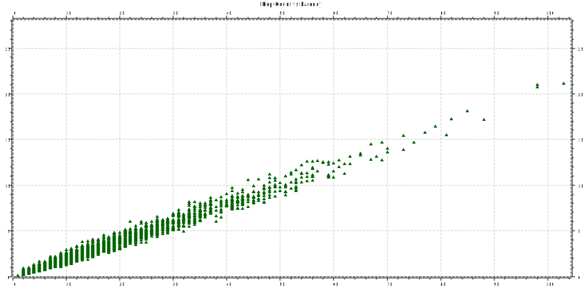
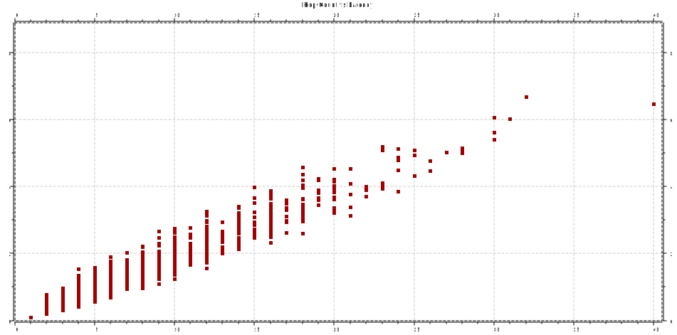

# CSCI-566 Project 1

- Nate Woods
- Lisa Peters

## Compiling
This has only been tested on Mac OSX Sierra

```
make clean
make
run
```

## Answers

### Part A
1. Install Omnet++ *(check)*
2. Go through the tic toc tutorial *(check)*
3. Do the exercise in Step 10 of the tic toc tutorial *(See QuestionA1)*
4. Do the exercise in Step 13 of the tic toc tutorial *(See QuestionA2)*
5. Add random processing delay at each node; Graph delay vs hop count.  
  For internal nodes (Indexs 0, 2, 3 and 5)  
    
  For internal nodes (Indexs 1 and 4)  
  

### Part B
1. WIP
