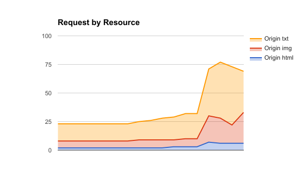

# CSCI-566 Project 1

- Nate Woods
- Lisa Peters

## Compiling
This has only been tested on Mac OSX Sierra

```
run
```

## Answers

### Part A
1. Install Omnet++
2. Go through the tic toc tutorial
3. Do the exercise in Step 10 of the tic toc tutorial
4. Do the exercise in Step 13 of the tic toc tutorial
5. Add random processing delay at each node; Graph delay vs hop count.  
###### Internal Nodes: Graph Delay vs Hop Count  <!-- For internal nodes (Indexs 0, 2, 3 and 5)   -->
    
###### External Nodes: Graph Delay vs Hop Count  <!-- For internal nodes (Indexs 1 and 4)   -->
  


### Part B

1. Clients only request contents from server1 and server2. Hint: you   should be able to do this with configuration files – without changing the code.
2. Content is initially stored only on the origin server.
3. server1 and server2 have limited space in their caches. If they do not have the content cached, they issue an HTTP request for the content to the origin server and cache the reply. Implement LRU cache replacement policy with direct lookup of content.
4. server1 and server2 check with each other before forwarding the request to the origin server.
5. Show a graph of request delay versus cache size.
*Note: For the following graphs, each simulation was run for a total of 200000 events and with a single client.*


###### Request by Resource

###### Cache Size and Total Requests

###### Cache Size versus End to End Delay (in seconds)

